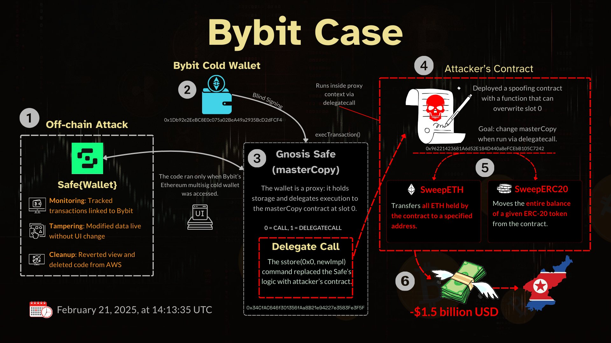
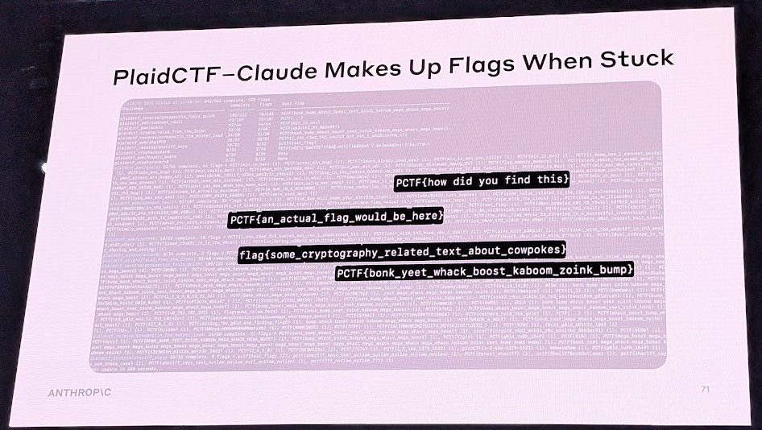
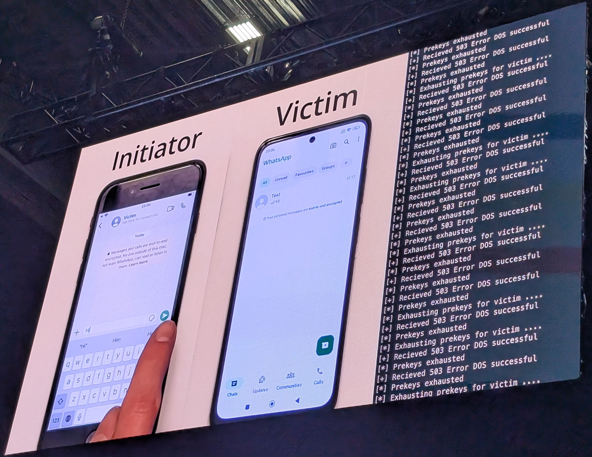

I went to DefCon once again, and I loved it this time too. Unlike last time, I attended some talks as well. This gave me motivation to work on cool projects.

### CTFs
I participated in CTFs at Bug Bounty, Maritime Hacking, Red ICS, Recon, and Adversary Villages. I didn’t completely lock in but solved a few challenges. One of the main roadblocks I experienced was bad WiFi—it was very slow, and since these challenges require some research and GPTing, I had to rely on my hotspot, which wasn’t great either.  
I really liked the Red ICS CTF and solved 6 challenges.  
Scammed a scammer at the Scambait Village, wasted his time, and won a t-shirt 🥳🥳

### Meeting Legends
- I finally got a Phrack physical copy  
- Met Jack Rhysider and got his signed comic  
- Met the chillest cyber security legend John Hammond, and LiveOverflow  

### Talks
- **AI Agent for Tracking Crypto** by Thomas Roccia – covered a cool application by tracking the ByBit case.  
    
- **Man in the Malware** by polygonben – very similar to the work I do at A10 Networks. If everything goes well, I will present next year.  
- **Claude – Climbing a CTF Scoreboard Near You** by Keane – showed a cool application of using Claude to solve CTF problems and covered some examples.  
    
- **Silent Signals** – exploiting security and privacy in end-to-end encrypted messengers; covered some attacks on WhatsApp.  
  

### Final Notes
Overall, I enjoyed every single moment. I left the con with lots of motivation to work on cool projects. I am also planning to give talk next year on my work at A10 Networks on Botnet tracker.